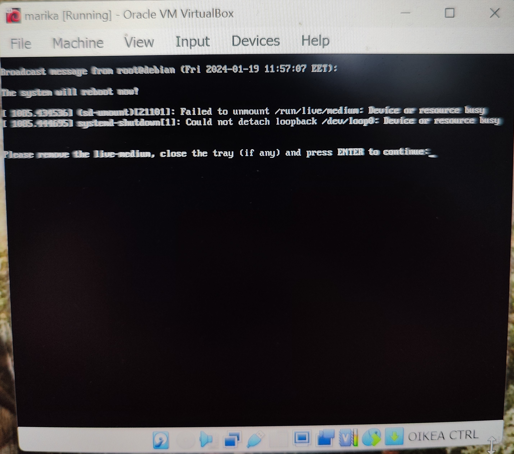

## Linux läksyt h1 Oma Linux

### tehtävä x: Tiivistelmä luetusta artikkelista
#### "Mitä ovat vapaat ohjelmistot?"

- Perusajatukseltaan vapaa ohjelmisto = kunnioittaa käyttäjien vapauta ja yhteisöllisyyttä
- Vapaa ei välttämättä tarkoita ilmaista, vaan termillä 'vapaa' viitataan käyttäjän oikeuksiin käyttää, kopioida, muokata ja jakaa ohjelmaa
- Ohjelma on vapaa, mikäli se täyttää neljä kriteeriä:
  - käyttäjällä on oikeus käyttää ohjelmaa mihin ja miten haluaa, kaupallisesti tai ei-kaupallisesti
  - käyttäjällä on oikeus tarkistella, miten ohjelma toimii ja muuttaa sen toimintatapaa omien 
   halujensa ja tarpeidensa mukaisesti
  - käyttäjällä on oikeus jakaa eteenpäin kopioita ohjelmasta
  -  käyttäjällä on oikeus jakaa eteenpäin kopioita ohjelmaan tekemistään muutoksista
- Ohjelman lähdekoodin tulee olla saatavilla, eikä se saa olla suunniteltu niin, että muokatut versiot ohjelmasta eivät toimi (ns. "lockdown" / "secure boot")
- Ohjelman vapautta miettiessä tulee huomioida kaikki käytetyt koodit ja arvioida, tekeekö niiden välinen keskinen riippuvuus tarpeelliseksi, että ne ovat kaikki vapaita
- Vapaa ohjelma voi olla myös kaupallinen, ja sen käyttö kaupallisiin tarkoituksiin on oltava sallittua
  - käyttäjän tulee siis saada kopioida ja jakaa (joko alkuperäistä tai muokattua versiota) rajattomasti, joko ilmaiseksi tai voittoa tehden
- Näiden vapauksien tulee koskea kaikkia käyttäjiä tasa-arvoisesti
- Käyttäjän pitää saada jakaa ohjelmaa ja sen verisoita täysin vapaasti, ilman erillisiä lupia tai ilmoituksia.
- Sen, että ohjelma on vapaa, ei kuitenkaan tarvitse taata ohjelman hyödyllisyyttä tai käytännöllisyyttä
- Tietynlaiset jakelutapaa koskevat säädökset, kuten copyleft, ovat sallittuja eivätkä vaikuta ohjelman vapauteen, kunhan ne edesauttavat neljän ydinkriteerin täyttymistä
   - pakkaamiseen ja jakeluun liittyvät säädökset ja rajoitukset ovat sallittuja, kunhan ne eivät ole käyttäjälle kohtuuttoman raskaita. Esimerkkinä vaatimus logon poistamisesta muokatuissa ohjelmaversioissa
   - mikäli ohjelman lisenssi edellyttää ohjelman nimen vaihtamista muokatuissa versioissa, tulee säilyttää vaihtoehto määrittää alkuperäisen ohjelman nimi muunnellun version aliakseksi, jotta ohjelma voidaan yhä määritellä vapaaksi
- Vapaan ohjelman lisenssissä ei saa vaatia kuin vähäisen vientisääntelyn nouudattamista. Näin valtiolliset vientisäädökset ja kauppapakotteet eivät vaikuta ohjelman vapauteen
- Ohjelman kehittäjällä ei saa olla mahdollisuutta palata muokkaamaan ohjelman lisenssiä ja sen ehtoja jälkikäteen
- Ohjelman lisenssi voi perustua tekijänoikeuksiin tai yksittäisiin sopimuksiin. Lisenssin peruste ei kuitenkaan saa rikkoa vapaan ohjelman neljää perusvaatimusta
- Myös ohjelman käsikirjojen tulee olla vapaasti saatavilla, sillä ne lasketaan olennaiseksi osaksi ohjelmaa

### tehtävä a: Linuxin asentaminen virtuaalikoneeseen
#### Raportti

Asensin Linuxin virtuaalikoneelle. Virtuaalikone on kannetavalla Lenovo Ideapad 5 Pro tietokoneella. Asennuksen apuna käytin kurssin "Linux-palvelimet - ICI003AS2A-2003" ensimmäisellä luennolla (16.1.2024) ottamiani muistiinpanoja, sekä Tero Karvisen nettisivulla annettua ohjeistusta: https://terokarvinen.com/2021/install-debian-on-virtualbox/

11:42 Virtualikoneen näytöltä valinta "Install Debian"
  - näytölle tulevasta valintaikkunasta valinta "launch anyway"
  - kielivalinnaksi american english -> valinta "next"
  - timezone valinnaksi "Suomi" valitsemalla SUomi näytöllä näkyvästä karttakuvasta -> valinta "next"
  - näppäimistövalinnasta ensimmäisestä valikosta "suomi", toisesta "default" -> valinta "next"

11:44 Partitions-välilehdellä
  - Valinta "Erase disk"
  - Muut asetukset jäävät oletusarvoisiksi

11:45 Users-välilehdellä
  - Käyttäjätunnuksien ja salasanan asettaminen

11:48 Virtuaalikoneen näytössä näkyvää "Suurenna ikkunaa" näppäintä painamalla sain näkyviin "Finish" painikkeen, jota painamalla pääsin etenemään asennuksessa "Summary"-välilehdelle

11:51 Valinta "Install"

11:56 Asennus valmis
  - valinta "Restart now" = Yes -> valinta "Done"
  - virtuaalikone tarjosi seuraavan errorviestin
  
  - Painoin "Enter" näppäintä

11:58 Virtuaalikone välkytti näyttöä muutaman kerran, ja käynnistyi sitten uudelleen ilman virheilmoituksia

12:01 Virtuaalikoneen testaus
  - avasin virtuaalikoneella selaimen, ja siirryin osoitteeseen terokarvinen.com. Nettisivu toimi moitteettomasti
  
