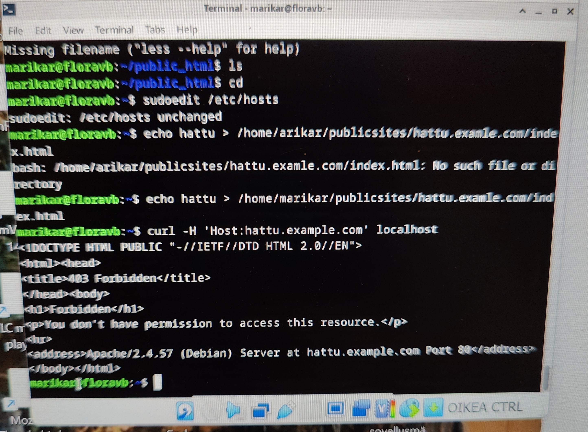

### Tehtävä x: tiivistelmä luetusta artikkelista
#### 'Name-based Virtual Host Support'

- IP-pohjaiset virtual hostit vaativat erillisen IP-osoitteen, nimi-pohjaiset jakavat yhden
- Ensin luodaan <VirtualHost>-lohko jokaiselle isännälle
    - Jokaiseen lohkoon tulee määrittää vähintään ServerName ja DocumentRoot.
- Pyynnöille, jotka eivät sovi olemassa olevaan <VirtualHost>-lohkoon, käytetään oletuskäsittelyä
- Nimi-pohjaiset isännät käsitellään siinä järjestyksessä, jossa ne esiintyvät kokoonpanossa
- <VirtualHost>-lohkoihin sijoitetut direktiivit hienosäätävät virtuaalipalvelimien asetuksia.
- Pääpalvelinasetusten direktiivit otetaan käyttöön, ellei niitä korvata virtuaalipalvelimen asetuksilla.

#### 'Name Based Virtual Hosts on Apache – Multiple Websites to Single IP Address'

- Nimi-pohjaisen virtuaalipalvelimen asentaminen Apache2:lla:
   - Apache2 asentaminen ja oletussivun korvaaminen.
   - Uuden nimi-pohjaisen virtuaalipalvelun lisääminen
   - Uuden nettisivun luominen normaalina käyttäjänä
   - Verkkosivun testaus curlilla ja nimi-palvelun simulointi.
      - ns. ”oikeassa tilanteessa” nimi vuokrataan palveluntarjoajalta
    
### Tehtävä a)

Kuten kaikki myöhemmätkin tehtävät, tämä on toteutettu Lenovo Ideapad 5 Pro tietokoneelle asennetulla virtuaalikoneella, jossa käytössä Debian.

18:10 Testataan localhost.com sivun vastaamista. Sivu jää lataamaan, eikä aukea

### Tehtävä b)

19:00 rivit, jotka saan lokista auki yritettyäni avata localhost-sivua:
    
    127.0.0.1 - - [30/Jan/2024:08:40:28 +0200] "GET /icons/openlogo-75.png HTTP/1.1" 200 6040 "http://localhost/" "Mozilla/5.0 (X11; Linux x86_64; rv:109.0) Gecko/20100101 Firefox/115.0"
    127.0.0.1 - - [30/Jan/2024:08:40:28 +0200] "GET /favicon.ico HTTP/1.1" 404 487 "http://localhost/" "Mozilla/5.0 (X11; Linux x86_64; rv:109.0) Gecko/20100101 Firefox/115.0"
    127.0.0.1 - - [30/Jan/2024:11:02:21 +0200] "GET / HTTP/1.1" 200 3380 "-" "Mozilla/5.0 (X11; Linux x86_64; rv:109.0) Gecko/20100101 Firefox/115.0

Rivi 1:
-	IP-osoite: 127.0.0.1
-	Pyynnön päivämäärä ja aika: 30/Jan/2024:08:40:28 +0200
-	HTTP-metodi ja pyyntö: "GET /icons/openlogo-75.png HTTP/1.1"
     - nopealla googlehaulla tämä vaikuttaisi olevan debianin logo
-	Vastauskoodi: 200
     - koodin mukaan kohteen haku onnistui
-	Siirretty tavumäärä: 6040
-	Viittaava URL: "http://localhost/"
-	Käyttäjäagentti: "Mozilla/5.0 (X11; Linux x86_64; rv:109.0) Gecko/20100101 Firefox/115.0"
     - Käytetään Mozilla-selaimen versiota 5.0
     - Käyttöjärjestelmänä  on Linux
     - Selaimen moottori on Gecko
     - Firefox-selaimen tarkka versionumero on 115.0

Rivi 2:
-	IP-osoite: 127.0.0.1
-	Päivämäärä ja aika: 30/Jan/2024:08:40:28 +0200
-	HTTP-metodi ja pyyntö: "GET /favicon.ico HTTP/1.1"
-	Vastauskoodi: 404
     - haettua kohdetta ei löytynyt
-	Siirretty tavumäärä: 487
-	Viittaava URL: "http://localhost/"
-	Käyttäjäagentti: "Mozilla/5.0 (X11; Linux x86_64; rv:109.0) Gecko/20100101 Firefox/115.0"

Rivi 3:
-	IP-osoite: 127.0.0.1
-	Päivämäärä ja aika: 30/Jan/2024:11:02:21 +0200
-	HTTP-metodi ja pyyntö: "GET / HTTP/1.1" Pääsivun hakeminen
-	Vastauskoodi: 200
-	Siirretty tavumäärä: 3380
-	Viittaava URL: "-"
-	Käyttäjäagentti: "Mozilla/5.0 (X11; Linux x86_64; rv:109.0) Gecko/20100101 Firefox/115.0"

Yrittäessäni hakea localhost-sivua, osa pyynnöistä onnistui, mutta eivät kaikki. Sivu ei siis koskaan auennut, vaan jäi lataamaan.

### Tehtävä c)

19:30 Lähdin luomaan uutta nimi-pohjaista isäntää

    $ sudoedit /etc/apache2/sites-available/hattu.example.com.conf
    $ cat /etc/apache2/sites-available/hattu.example.com.conf
    <VirtualHost *:80>
    ServerName hattu.example.com
    ServerAlias www.hattu.example.com
    DocumentRoot /home/marikar/publicsites/hattu.example.com
    <Directory /home/marikar/publicsites/hattu.examle.com>
    Require all granted
    </Directory>
    </VirtualHost>
    $ sudo a2ensite hattu.example.com
    $ sudo systemctl restart apache2

hattu.example.com.conf löytyi apachen kansioista kun hain kaikki käytettävät kansiot

19:41 Yritin luoda nettisivua tavallisena käyttäjänä

    $ mkdir -p /home/marikar/publicsites/hattu.example.com/
    $ echo hattu > /home/marikar/publicsites/hattu.example.com/index.html

Tässä vaiheessa Linuxin komentorivi ei reagoinut näihin komentoihin mitenkään.

19:45 Päätin kuitenkin testata mitä tapahtuu mikäli yrotän pyörittää sivuja curl-käskyllä

    $ curl -H 'Host: hattu.example.com' localhost
    $ curl localhost

Ensimmäisellä komennolla sain seuraavanlaisen virheviestin

Toinen komento avasi debianin localhost oletusivun komentoriviin. Kuitenkin, yrittäessni hakea hattu.example.com osoitetta selaimessa, selain ilmoitti ettei sellaista ole olemassa.

20:00 En löytänyt virhelokista selitystä miksi hattu.example.com ei toimi. Selattuani useamman sivun googlen hakutuloksia jouduin toteamaan, että oma ällini ei riitä tämän selvitykseen. Jatkan siis seuraavaan tehtävään ja palaan tähän, mikäli eteneminen tuottaa uusia valaistumisia.

### Tehtävä d)

En saa HTML5 sivua näkyviin aiemmin tehdyllä ivustolla. Lisään sen siis vain koodina tähän

    <!DOCTYPE html>
    <html lang="fi">
    <head>
        <meta charset="UTF-8">
        <title>Yksinkertainen HTML5-sivu</title>
    </head>
    <body>

        <header>
            <h1>Tervetuloa!</h1>
        </header>

        <main>
            
Tämän yksinertaisen HTML5 sivun kuuluisi näkyä hattu.example.com sivulla.

            
Todellisuudessa se on kumminkin hyvin epätodennäköistä

        </main>

        <footer>
            
2024 Marika Royhkio

        </footer>

    </body>
    </html>

### Tehtävä e)

curl -I komento pyytää vain HTTP-otsikoita, näyttämättä sivun varsinaista sisältöä. Itse käytin esimerkkihakuna

    curl -I https://terokarvinen.com

ja sain seuraavanlaisen tuloksen:

    HTTP/1.1 200 OK
    Date: Sun, 04 Feb 2024 19:48:09 GMT
    Server: Apache/2.2.14 (Ubuntu)
    Last-Modified: Tue, 30 Jan 2024 13:20:05 GMT
    ETag: "3c5b-610299ee13f19"
    Accept-Ranges: bytes
    Content-Length: 15451
    Cache-Control: max-age=1800, public
    Expires: Sun, 04 Feb 2024 20:18:09 GMT
    Vary: Accept-Encoding
    X-Powered-By: PHP/5.3.2-1ubuntu4.30
    X-Varnish: 1613764200 1613764198
    Content-Type: text/html

- 1.rivi on HTTP-protokollan vastauskoodi. Tässä tapauksessa se näyttää pyynnön onnistuneen
- 2.rivi näyttää aikaleiman ajankohdalle, joslloin vastaus luotiin
- viimeinen rivi kertoo vastauksen sisällön tyypin; tässä tapauksessa tekstiä ja HTML-muotoiluja
  
curl - komento näyttää sivun täyden sisällön.

    
    

