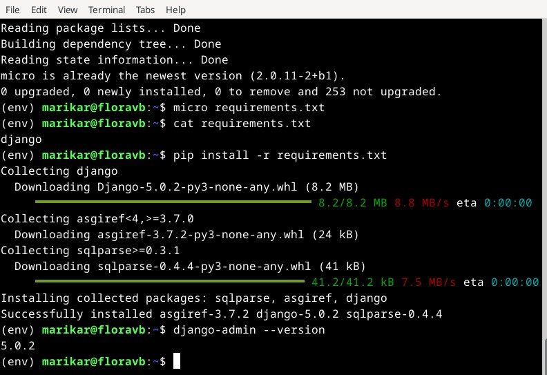
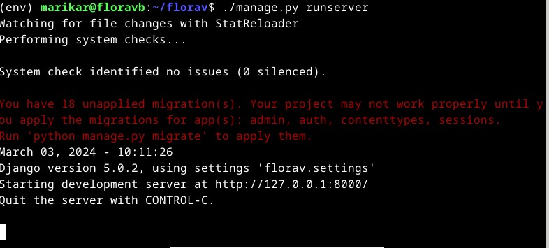

## h6 DJ-ango

### tehtävä x) Tiivistelmä 

##### Django 4 Instant Customer Database Tutorial

- Ympäristön asennus:
    - virtuaaliympöäristö asennetaan komennolla 'sudo apt-get -y install virtualenv'
    - projektin aluksi luodaan uusi Python virtuaaliympäristö nimeltä "env/" ja aktivoidaan se
- Django-projektin aloitus
    - Uusi Django-projekti luodaan komennolla 'django-admin startproject' ja valitsemasi projektin nimi
    - Virtuaaliympäristö aktivoidaan ja käynnistetään
- Asiakastietokannan luominen ja hallinta
    - Luodaan crm sovellus ja liitetään se projektiin
    - määritetään malli, migroidaan se ja rekisteröidään se adminille
 
##### Deploy Django 4 - Production Install

- Ympäristön asetukset:
    - päivitetään pakettitiedot 'sudo apt-get update'
- Apache2 asennus ja koonfigurointi
    - apache asennetaan komennolla ' sudo apt-get -y install apache2'
    - apachen asennuksen saa testattua hakemalla selaimella http://localhost. Näkyykö oletussivu?
- WEB-sisällön ja apache-yhteyden luominen Djangoon
    - luodaan HTML-sivu '/var/www/html/index.html'
    - luodaan kotihakemistoon kansio ja lisätään sinne esimerkkisisältöä
    -  -luodaan uusi VirtualHost apachelle, ja käynnistetään verkkosivusto
    -  Django asennetaan virtuaaliympäristöön ja liitetään se Apacheen käyttämällä mod_wsgi-moduulia

Kaikki tässä raportissa läpikäydyt tehtävät on tehty virtuaalikoneella, joka käyttää Debiania. Virtuaalikone on asennettu Lenovo IdeaPad 5 Pro kannettavalle.

### Tehtävä a) Yksinkertainen esimerkkiohjelma Djangolla

Aloitetaan ympäristön asentamisesta.

    $ sudo apt-get -y install virtualenv

Luodaan uusi virtualenv

    $ virtualenv --system-site-packages -p python3 env/

Aktivoidaan uusi ympäristö

    $ source env/bin/activate

Komentorivillä näkyy nyt, kuinka käytössä on äsken luotu virtuaaliympäristö

Varmistetaan vielä, että käytössä  on virtuaaliympäristö, että pip-komennon käyttämine on turvallista

    $ which pip
    /home/marikar/env/bin/pip

Tehdään Djangon asennus pip-komennolla tekstitiedoston kanssa

    $ micro requirements.txt # "django"

    $ cat requirements.txt
    django

    $ pip install -r requirements.txt

Asennus kesti noin  minuuttia

Django version tarkistus

    $ django-admin --version

Aloitetaan projekti sivulle

    $ django-admin startproject florav

Kokeillaan projektin toimivuutta

    $ cd florav
    $ ./manage.py runserver

Komento tuotti pitkän litanian punaista tekstiä jonka ensikatsomalta luulin olevan jonkinlainen ratkaiseva error-viesti

Löysin kuitenkin osoitteen jota pystyin kokeilemaan selaimessa, ja sivu näytti toimivan täysin ongelmitta.

Pysäytin serverin ctrl + c

Seuraavaksi lisäsin adminin sivulle. Aloitin päivittämällä tietokannat:

    $ ./manage.py makemigrations
    $ ./manage.py migrate

Lisäsin käyttäjän

    $ sudo apt-get install pwgen
    $ pwgen -s 20 1 

    $ ./manage.py createsuperuser  # jätin tämän kohdan tyhjäksi käyttääkseni käyttäjänimenä ohjelman 
    ehdottamaa nimeä

Käynnistin sivun uudelleen 
    ./manage.py runserver
    
Seuraavaksi kirjauduin sisään sivustolle generoidulla salasanalla. Toimi!

Seuraavaksi lähdin luomaan asiakastietokantaa sivulle

    $ ./manage.py startapp crm

Lisäsin luodun crm/kansion sovellukseen

    $ micro florav/settings.py

    INSTALLED_APPS = [
    'django.contrib.admin',
    'django.contrib.auth',
    'django.contrib.contenttypes',
    'django.contrib.sessions',
    'django.contrib.messages',
    'django.contrib.staticfiles',
    'crm',
    ]

Loin microlla tiedoston, johon loin malleja

    $ micro crm/models.py 
    from django.db import models

    class Customer(models.Model):
    name = models.CharField(max_length=300)

Päivitin tietokannat:

    $ ./manage.py makemigrations
    $ ./manage.py migrate

Rekisteröin tietokannan

    $ micro crm/admin.py

    from django.contrib import admin
    from . import models

    admin.site.register(models.Customer)

Yritin käynnistää serverin uudelleen nähdäkseni äsken luomani mallin. CRM ei kuitenkaan näkynyt sivuilla, vaan näkymä on täysin sama kuin aiemmin. Seurasin ohejtta uudelleen, kävin läpi kaiken mitä olin tehnyt, eikä CRM silti näkynyt sivulla.

Tähän pisteeseen pääsin:

Lisään tähän vielä kuvat tiedostoista, joilla yritin luoda Customers-tietokantaa. Ehkä niissä on jokin väärässä sijainnissa?

Tässä kuva asetuksista

Tässä kuva models-tiedostosta

### tehtävä b) Djangon tuotantotyyppinen asennus

Päivitin kirjastot

    $ sudo apt-get update

Asensin micro-editorin 

    $ sudo apt-get -y install micro bash-completion
    $ export EDITOR=micro

Asensin apachen

    $ sudo apt-get -y install apache2

Localhost-sivu toimi normaalisti asennuksen jälkeen. Seuraavaksi korvasin apachen aloitussivun

    $ echo "See you at florav.com"|sudo tee /var/www/html/index.html

Localhost sivu näytti nyt tekstin, jola olin korvannut oletussivun. Seuraavaksi loin esimerkkisisältöä sivulle

    $ cd
    $ mkdir -p publicwsgi/florav/static/
    $ echo "Statically see you at florav.com"|tee publicwsgi/florav/static/index.html

Lisäsin uuden virtualhostin

    $ sudoedit /etc/apache2/sites-available/florav.conf

Lisäsin virtualhostin tiedot:

    <VirtualHost *:80>
	    Alias /static/ /home/marikar/publicwsgi/florav/static/
	    <Directory /home/marikar/publicwsgi/florav/static/>
		    Require all granted
	    </Directory>
    </VirtualHost>

Avasin sivun

    $ sudo a2ensite teroco.conf
    $ sudo a2dissite 000-default.conf 

Testasin konfiguroinnin enne sivun käyttöönottoa

    $ /sbin/apache2ctl configtest

Komentoon tullut vastaus on sama kuin ohejistuksessa

Syntax OK, joten uudelleenkäynnistin apachen

     $ sudo systemctl restart apache2

Tarkistin, että minulla on pääsy static-kansioon

    $ curl http://localhost/static/

Tässä vaiheessa tulos ei kuitenkaan ollut odotetunlainen:

Minulla ei ohjelman mukaan ollut oikeuksia tiedostoihin. Palasin askelissani taaksepäin, tarkistamaan että virtualhostin luonnissa oli kaikki oikein. Tiedostosta kuitenkin löytyi kirjoitusvirheitä :) Korjasin ne ohjeistuksen mukaisesti, ja sivusto toimi

    $ curl http://localhost/static/

    

Asensin Djangon virtuaaliympäristön

    $ sudo apt-get -y install virtualenv

    $ cd
    $ cd publicwsgi/

    $ virtualenv -p python3 --system-site-packages env

Aktivoin virtuaaliympäristön

    $ source env/bin/activate

Tarkistin, että pip asennus tulee virtuaaliympäristöstä

    $ which pip
    /home/marikar/publicwsgi/env/bin/pip

Loin tiedoston djangon asennukselle

   $ micro requirements.txt
   django

Asensin djangon tiedoston avulla

    $ pip install -r requirements.txt

Tästä eteenpäin edetessäni, ei mikään komento muuttanut localhost-sivua. Yditin luoda config-kansion ohjeistuksen mukaan, ja asentaa apachen WSGI modulen. Error-viestejä en saanut, mutta sivu jämähti ""Statically see you at florav.com"-viestiin.

#### Lähteet

- Django 4 Instant Customer Database Tutorial ( https://terokarvinen.com/2022/django-instant-crm-tutorial/)

- Deploy Django 4 - Production Install ( https://terokarvinen.com/2022/deploy-django/ )

- Oppitunnilla 27.3. otetut muistiinpanot

    

    

    

    

    

