### h7 "Maalisuora"

Kaikki tässä raportissa läpikäydyt tehtävät on suoritettu virtuaalikoneella, joka on asennettu Lenovo Ideapad 5 kannettavalle tietokoneelle. Virtuaalikone käyttää Debiania.

#### Tehtävä a) Käännös

Tehtävän palautettuani, ja muiden palautuksia nähtyäni totesin, että tehtävän ymmärrys meni varmaan vähän pieleen tämän kohdalla :) 

Avasin tekstieditorin luodakseni 'kaannos.sh' tiedoston

    nano kaannos.sh

Lisäsin bash-skriptin tiedostoon

    lause="Hei maailma"
    kieli="fi:ja"
    kaannos=$(trans -b -no-ansi ":$kieli" "$lause")
    echo "Alkuepräinen lause: $lause"
    echo "Käännös: $kaannos"

Tallensin tiedoston. Annoin sille suoritusoikeudet

    chmod +x kaannos.sh

Ja yritin suorittaa skriptin

    ./kaannos.sh

Skripti ei kuitenkaan toiminut

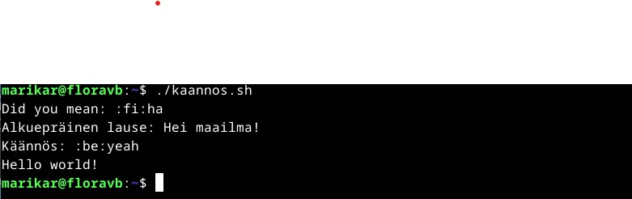

Totesin, että ehkä kielitunnus "ja" (japani" ei jostain syystä toimi, joten muokkasin skript-tiedostoa hieman, ja vaihdoin kohdekielen. Samalla määrittelin tiedon lähdekielelle, jos ohjelma vaikka ei tunnista sitä suomeksi?

    #!/bin/bash
    lause="Hei maailma"
    kieli_lahto="fi"
    kieli_kohde="zh-CN" 

    kaannos=$(trans -b -no-ansi ":$kieli_lahto:$kieli_kohde" "$lause")

    echo "Alkuperäinen lause ($kieli_lahto): $lause"
    echo "Käännös ($kieli_kohde): $kaannos"

Tämäkään ei toiminut, mutta tulos muuttui hieman:

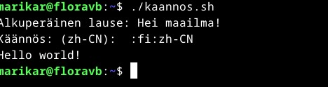

Seuraavaksi muokkasin skriptiä vielä uudelleen:

    lause="Hei maailma!"
    kieli_kohde="zh-CN"

    kaannos=$(trans -b -no-ansi ":fi:$kieli_kohde" "$lause")

    echo "Alkuperäinen lause: $lause"
    echo "Käännös: ($kieli_kohde): $kaannos"

Tämäkään ei toiminut, vaan lopputulos oli sama. Kokeilin vielä vaihtaa toivottua kohdekieltä espanjaan, toivoen että kyse on vain siitä, että ohjelma ei tunnistaisi japanin ja kiinan kielen lyhenteitä

    lause="Hei maailma"
    kieli="fi:es"
    kaannos=$(trans -b -no-ansi ":$kieli" "$lause")
    echo "Alkuepräinen lause: $lause"
    echo "Käännös: $kaannos"

Käännös ei toiminut vieläkään:

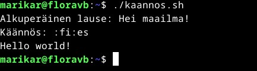

Tässä vaiheessa ohjelmoijalta loppui ymmärrys ja täytyi siirtyä seuraavaan tehtävään :)

#### Tehtävä b)

Tarkistin, olenko luomassa skriptiä hakemistoon, joka sisältyy kaikkien käyttäjien ’PATH’ muuttujaan
    
    echo $PATH

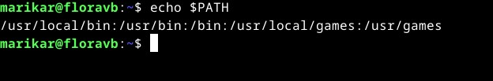

Sitten loin komentoskriptin nanolla
    
    nano /usr/local/bin/tehtavab

Sain seuraavan näkymän:
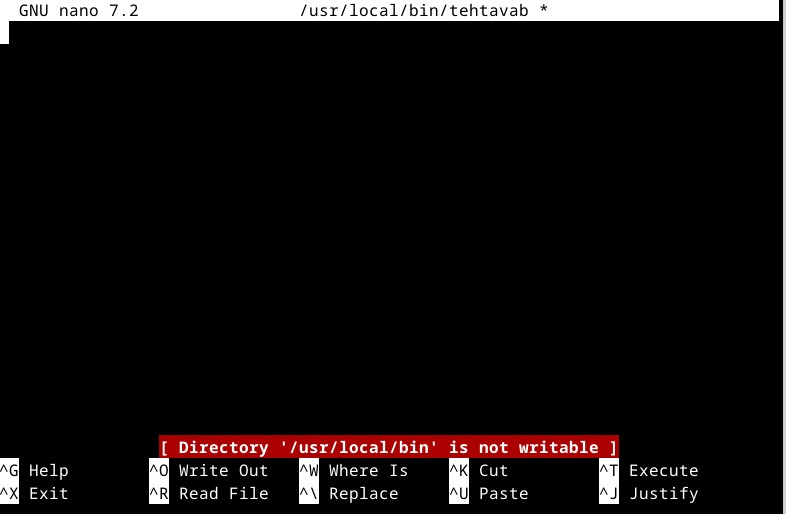

Tiedostoon pystyi kuitenkin kirjoittamaan joten kokeilin 😊
    
    echo ”Tämä on uusi komento Linux kurssin tehtävää varten”

Tekstiä ei pystynyt tallentamaan, vaan sain seuravan virheilmoituksen:

    ”Error writing /usr/local/bin/tehtavab: Permission denied”

Ensimmäinen impulssi oli yrittää luoda tiedosto sudo-komennolla, joten:

    sudo nano/usr/local/bin/tehtavab

Nyt aukesi ihan normaali nano tekstitiedosto ilman huomautuksia. Kirjoitin tiedostoon saman tekstin kuin aiemmin, ja tallensin sen. Seuraavaksi kokeilin antaa suoritusoikeuksia:
    
    sudo chmod +x /usr/local/bin/tehtavab

Seuraavaksi yritin suorittaa skriptin:
    
    tehtavab
Sain seuraavan virheilmoituksen:

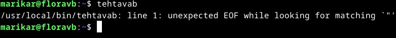´

Korjasin kirjoitusvirheen ja kokeilin uudelleen

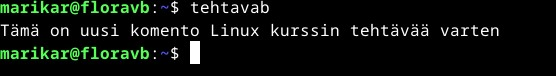

Toimii? Tarkistin vielä erikseen käyttöoikeudet:
    
    ls -l /usr/local/bin/tehtavab

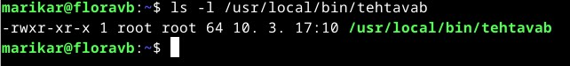

Tiedoston oikeudet näyttävät olevan asetettu niin, että ne ovat kaikkien käyttäjien suoritettavissa

#### Tehtävä c)

##### Valitsemanni arvioitava labratehtävä on Arvioitava laboratorioharjoitus – Linux palvelimet ict4tn021-3 (uusi OPS) alkukeväällä 2017 p1 (https://terokarvinen.com/2017/arvioitava-laboratorioharjoitus-linux-palvelimet-ict4tn021-3-uusi-ops-alkukevaalla-2017-p1/)

Siirryin apache palvelimen juurikansioon:
    
    cd /var/www/html

Lähdin kokeilemaan html-sivujen luontia bash skriptillä
   
    nano uudet_html_sivut.sh

Bash-skripti:

    users=("Jorma Mähkylä" "Pekka Hurme" "Ronaldo Smith" "Håkan Petersson" "Einari Mikkonen" "Einari Vähäkäähkä" "Eija Vähäkäähkä")
    usernames=("jorma_m" "pekka_h" "ronaldo_s" "hakan_p" "einari_m" "einari_v" "eija_v")

    root_directory="/var/www/html"

    for i in "${!users[@]}"; do
        user="${users[$i]}"
        username="${usernames[$i]}"
  
        cat <<EOF > "$root_directory/$username.html"
    <!DOCTYPE html>
    <html lang="fi">
    <head>
      <meta charset="UTF-8">
      <meta name="viewport" content="width=device-width, initial-scale=1.0">
      <title>$user - Kotisivu</title>
    </head>
    <body>

      <header>
        <h1>$user</h1>
        
Omistajan käyttäjätunnus: $username

      </header>

    </body>
    </html>
    EOF

    done

Sain kuitenkin virheilmoituksen:
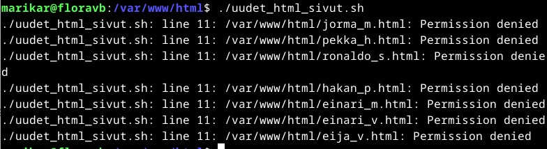

Kokeilin suorittaa skriptin sudo komennolla, ja sen jälkeen uudelleen tavallisella komennolla 
    
    ./uudet_html_sivut.sh

Nyt se toimi

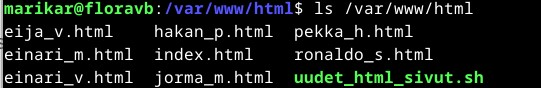

Sivut myös näkyvät selaimessa localhostissa

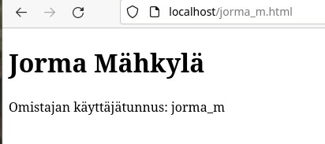

Seuraavaksi loin Maija Virtaselle käyttäjän, jolla on sudo-oikeudet:
   
    sudo adduser maija

Annoin Maijalle salasanan, ja täytin tietoihin Koko nimen Maija Virtanen

Lisäsin Maijan sudo-käyttäjäksi
    sudo usermod -aG sudo maija

Seuraavaksi yritin luoda Jormalle kotisivunsivun

    sudo nano /etc/hosts

Lisäsin tiedoston loppuun seuraavan rivin simuloidakseni nimipalvelun toimintaa:

    127.0.0.1 sleep.example.com

Uudelleenkäynnistin apachen. Jostain syystä Jorman sleep.example.com sivu ei näy. En saa aiemmin asettamaani localhost sivua korvattua, vaikka lisäsin host-tiedostoon sleep.example.com sivulle uuden lähteen. Yritin tyhjentää selaimen välimuistinkin, enkä silti saanut sivua näkymään.

Seuraavaksi asensin palomuurin:

    sudo apt-get update
    sudo ufw allow 22/tcp
    sudo ufw enable

Valitsemani labratehtävän seuraavat kohdat eivät tuntuneet aihepiireiltään tutuilta, tai siltä että niitä olisi tällä kurssilla käsitelty(tässä saattaa toki olla vaan kyse minun ymmmärryksen puutteeesta), joten hyppäsin ne yli.

    
  

